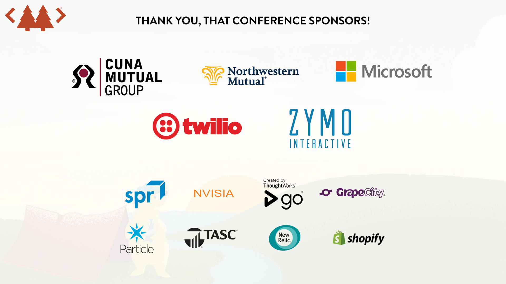

# Up For Grabs

## Getting Started with Open Source

### Keith Dahlby

<https://github.com/dahlbyk>

<https://twitter.com/dahlbyk>

### NewBoCo

Accelerating world-changing ideas, from Iowa.

---



---

## What is Open Source?

"Open Source software is software that can be freely accessed, used, changed, and shared (in modified or unmodified form) by anyone."

**Legally** accessed, used, changed, and shared by anyone.

---

## Meet Frank


> I am _a_ lawyer, but I am not _your_ lawyer.

---

## What is copyright?

> Copyright is a form of protection grounded in the U.S. Constitution and granted by law for **original works of authorship** fixed in a tangible medium of expression. Copyright covers both published and unpublished works.

### Copyright Clause

> The Congress shall have power
>
> * To promote the Progress of Science and useful Arts, by securing for **limited Times** to Authors and Inventors the exclusive Right to their respective Writings and Discoveries;

<https://en.wikipedia.org/wiki/Copyright_Clause>

---

## What does copyright protect?

> Copyright, a form of intellectual property law, protects original works of authorship including literary, dramatic, musical, and artistic works, such as poetry, novels, movies, songs, **computer software**, and architecture. Copyright does not protect facts, ideas, systems, or methods of operation, although it may protect the way these things are expressed.

### How is a copyright different from a patent or a trademark?

> Copyright protects original works of **authorship**, while a patent protects **inventions or discoveries**. Ideas and discoveries are not protected by the copyright law, although the way in which they are expressed may be.
> A trademark protects **words, phrases, symbols, or designs** identifying the source of the goods or services of one party and distinguishing them from those of others.

---

## When is my work protected?

> Your work is under copyright protection the **moment it is created** and fixed in a **tangible form** that it is perceptible either directly or with the aid of a machine or device.

### Do I have to register with your office to be protected?

> **No.** In general, registration is voluntary. **Copyright exists from the moment the work is created.** You will have to register, however, if you wish to bring a lawsuit for infringement of a U.S. work.

<https://www.copyright.gov/help/faq/faq-general.html>

---

## Free Content

> Wikimedia Commons only accepts media
> 
> * that are explicitly [freely licensed](https://freedomdefined.org/Definition), or
> * that are in the public domain in at least the United States and in the source country of the work.

<https://commons.wikimedia.org/wiki/Commons:Licensing>

---

## Essential Freedoms of _Free Cultural Works_

* The freedom to use and perform the work
* The freedom to study the work and apply the information
* The freedom to redistribute copies
* The freedom to distribute derivative works

<https://freedomdefined.org/Definition>

---

## Creative Commons

> Creative Commons licenses are legal tools that creators and other rights holders can use to offer **certain usage rights** to the public, while **reserving other rights**.
>
> CC licenses may be applied to any type of work, including educational resources, music, photographs, databases, government and public sector information, and many other types of material. The only categories of works for which CC **does not recommend** its licenses are **computer software and hardware.**

<https://creativecommons.org/faq/>

---

## Free Software vs Open Source

### Gratis

Free as in beer

### Libre

Free as in speech

---

## Freeware

* Free to use (_gratis_)
* No access to source

### Hiding in plain sight

* First-party apps
* IE, Edge, Safari, Chrome, Opera
* SaaS clients (Slack, Spotify)

---

## Source Available

### [Microsoft Reference Source License](https://referencesource.microsoft.com/license.html)

> "Reference use" means use of the software within your company as a reference, in read only form, for the sole purposes of debugging your products, maintaining your products, or enhancing the interoperability of your products with the software, and **specifically excludes the right to distribute the software** outside of your company.

### [GitLab Enterprise Edition License](https://gitlab.com/gitlab-org/gitlab-ee/blob/master/LICENSE)

> This EE License applies only to the part of this Software that is not
distributed as part of GitLab Community Edition (CE), and that is not a file
that produces client-side JavaScript, in whole or in part.

---

## Free Software Foundation

> Free software means that the software's users have freedom. (The issue is not about price.) […]
>
> Specifically, free software means users have the four essential freedoms: (0) to **run the program**, (1) to study and **change the program** in source code form, (2) to **redistribute** exact copies, and (3) to **distribute modified versions**.

* Freedom of use (_libre_)
* Founded by Richard Stallman in 1985
* GNU Project (GCC, GNOME, GIMP, etc)
  * Linux vs GNU/Linux
* GNU General Public Licenses

<https://www.fsf.org/>

---

## Open Source Initiative

> Like the FSF, the OSI's founders supported the development and distribution of free software, but they disagreed with the FSF about how to promote it, believing that software freedom was **primarily a practical issue rather than an ideological one**.

* Founded by Bruce Perens and Eric S. Raymond in 1998
* Authored _The Open Source Definition_
* Apache, BSD, GPL, LGPL, MIT, Mozilla, Eclipse

<https://opensource.org/>

---

## The Open Source Definition

1. Free Redistribution
2. Source Code
3. Derived Works
4. Integrity of The Author's Source Code
5. No Discrimination Against Persons or Groups
6. No Discrimination Against Fields of Endeavor
7. Distribution of License
8. License Must Not Be Specific to a Product
9. License Must Not Restrict Other Software
10. License Must Be Technology-Neutral

<https://opensource.org/osd-annotated>

---

## Why Open Source?

### For Business

* Talent
* External Input
* Transparency
* Acceleration
* Security

---

## Why Open Source?

### For Individuals

* Talent
* External Input
* Exploration
* Experimentation

---

## How to Open Source

### Open Source Communities (Forge)

* **GitHub** (24M users, 69M projects)
* Bitbucket (5M users)
* Launchpad (4M users)
* SourceForge (3.7M users)
* **GitLab** (100k users)
* ~~CodePlex~~
* ~~Google Code~~

<https://en.wikipedia.org/wiki/Comparison_of_source_code_hosting_facilities>

---

## 1. What do you want to work on?

* Project you use
* Project you're interested in
* Project that needs help
* Your own project

---

## 1a. Who needs help?

[](https://up-for-grabs.net/)

GitHub search: [up-for-grabs](https://github.com/search?q=label%3Aup-for-grabs&state=open&type=Issues) | [first-timers-only](https://github.com/search?utf8=%E2%9C%93&q=label%3Afirst-timers-only&type=Issues&state=open)

[Discover Repositories on GitHub](https://github.com/discover)

[Your First PR](https://yourfirstpr.github.io/)

---

## 2. Is the project healthy?

* Stars/Watchers/Forks

### Issues

* Open/Closed
* Labels/Milestones/Projects
* Comments

### Pull Requests

* Open/Closed
* Status Checks

---

## 2a. GitHub Insights

* Pulse: Recent activity
* Contributors: Activity over time, by whom
* Community
  * Readme
  * Code of conduct
  * Contributing guidelines
  * License
  * Issue template
  * Pull request template

---

## 3. What do you want to do?

* Improve documentation or examples
* Report and/or fix a bug
* Propse and/or add a feature
* Improve project health

---

## 3a. Improve documentation or examples

### New to this project?

1. Note your questions while getting started, or questions you see in Issues
2. Use the source and docs to clarify your understanding
3. Propose improvements

### Been using this project?

1. Note questions you and your team have had
2. Use the source and docs to clarify your understanding
3. Propose improvements

---

## 3b. Report and/or fix a bug

1. If an Issue doesn't already exist (search!), create one
    * Avoid duplicates
    * Link to related Issue or Pull Request
    * Fill out issue template
    * Details, details, details
      * Project version and installation source
      * Environment (OS, browser, runtime versions)
      * Minimal repro
2. If you know enough to attempt a fix, comment as such on the issue
    * "I'm working on a fix for this. I believe the issue is around [here]."
3. Open a Pull Request as soon as you have progress worth discussing
    * **The solution does not need to be complete**

---

## 3c. Propose and/or add a feature

1. If an Issue doesn't already exist (search!), create one
    * Avoid duplicates
    * Link to related Issue or Pull Request
    * Fill out issue template
2. Unless you need the feature regardless, wait for feedback before beginning
3. When you begin, and as you make progress, comment as such on the issue
4. Open a Pull Request as soon as you have progress worth discussing
    * **The solution does not need to be complete**

---

## Pull Request Process/Etiquette

1. Fork and clone the project

2. Create a local branch to work in

    ```bash
    git checkout -b my-branch
    ```

3. Commit **small**, incremental steps

4. Push your local branch to your fork

    ```bash
    git push -u origin HEAD
    ```

5. Compare & Pull Request

---

## Small, Incremental Steps

### When in Rome, code as the Romans do.

* Use tabs or spaces with proper indentation.
* Mimic quote styles, naming conventions, etc.
* Avoid commiting editor-specific files.

Make your changes blend in.

### DO NOT…

* …reformat whole files, let alone the whole project.
* …significantly refactor anything.

---

## Pull Request Feedback

* Be gracious about maintainer suggestions.
* Be humble if asked to make a change you disagree with stylistically.
* Be gentle giving corrections. "Well, actually…"

### Push Again

* **Small, incremental commits.**
  * One per point of feedback.
* Do not open a new PR; push to the same branch.
  * With `-u`, you can just `git push` now.
* If comfortable, offer to fixup/squash your commits.
  * Some projects are anti-`rebase`; do not argue.
  * Some projects require `rebase`; if uncomfortable, say so.

---

## 3d. Improve project health

### Most maintainers would _love_ this kind of help…

* Triage issues: can you reproduce? How severe?
* Add a build for missing platform(s).
* Release management is a pain.
* Many GitHub features (e.g. code of conduct) are relatively new.

### …but build trust first.

Why would a maintainer trust a stranger to triage?

---

## Questions?

### @dahlbyk Everywhere

[dahlbyk.github.io/Presentations/UpForGrabs/](https://dahlbyk.github.io/Presentations/UpForGrabs/)

### Resources

* <https://up-for-grabs.net/>
* <https://yourfirstpr.github.io/>
* <https://www.firsttimersonly.com/>
* <http://makeapullrequest.com/>
